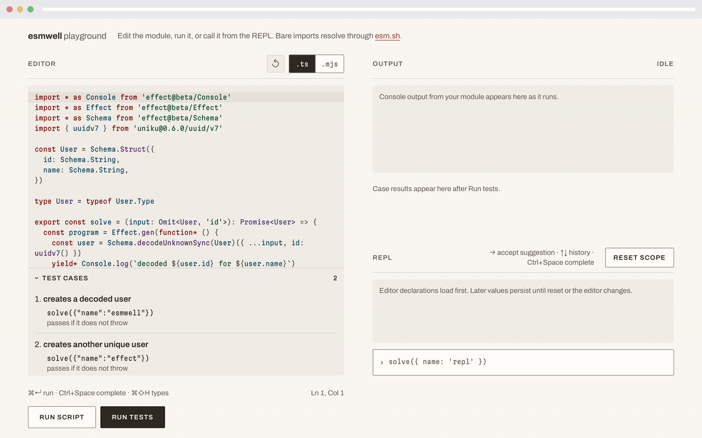

# esmwell

[](https://github.com/jkomyno/esmwell/actions/workflows/ci.yaml)
[](https://npmjs.com/package/esmwell)
[](https://npm.chart.dev/esmwell)
[](https://packagephobia.com/result?p=esmwell)
[](./LICENSE)

Run unbundled ESM in the browser with hard timeouts, dependency resolution, and normalized results.



`esmwell` is an ESM-only browser library for running JavaScript that was never bundled: a module a visitor typed into an editor, a snippet in a docs page, a test file in a virtual project.

- **Run** a module in a disposable worker, stream its console output, and get a structured result or a typed timeout instead of a frozen tab.
- **REPL** keeps declarations and imports alive across inputs until reset or timeout.
- **Test workspaces** run virtual ESM projects with lazily loaded Vitest or Jest engines.
- **Bare imports just work.** `import { z } from 'zod'` resolves through [esm.sh](https://esm.sh) at runtime. Pin versions with `deps` or inline (`effect@beta/Schema`).
- **TypeScript input** through a session `transform`. `esmwell/typescript` uses the `typescript` package you already have and never bundles the compiler.

```ts
import { createReplSession } from 'esmwell'

const repl = createReplSession({
  deps: { 'is-even': '1.0.0' },
  timeoutMs: 5_000,
})

await repl.evaluate(`import isEven from 'is-even'`)
const { value } = await repl.evaluate('isEven(2)') // true

repl.close()
```

The full API, setup for bundlers, and the execution model live in the [package README](./packages/esmwell#readme).

## How it works

Submitted judge and REPL modules run only inside a same-origin child worker that a trusted coordinator worker can terminate. Every judge run gets a fresh child. A REPL keeps its child until reset, timeout, or fatal failure. Test workspaces use a fresh page-owned worker per run so their service-worker-backed module graph works in Chromium and WebKit.

This gives you disposable browser realms and reliable timeout recovery. It is not a security sandbox. Submitted code keeps whatever browser worker capabilities the host page allows, including network access. See [Not a security sandbox](./packages/esmwell#not-a-security-sandbox) before running untrusted input.

## Repository

| Path                                     | Contents                                                        |
| ---------------------------------------- | --------------------------------------------------------------- |
| [`packages/esmwell`](./packages/esmwell) | The published library and its complete API guide                |
| [`apps/playground`](./apps/playground)   | The demo shown above: TypeScript editor, output panel, and REPL |
| [`docs/recipes`](./docs/recipes)         | Effect v4, WebAssembly, and composition recipes                 |
| [`COMPATIBILITY.md`](./COMPATIBILITY.md) | Verified ECMAScript, package, and runtime compatibility matrix  |
| [`CONTRIBUTING.md`](./CONTRIBUTING.md)   | Local setup and checks                                          |
| [`SECURITY.md`](./SECURITY.md)           | How to report a vulnerability                                   |

Only `packages/esmwell` is published. The workspace root and every app under `apps/` stay private.

## License

[MIT](./LICENSE) © [Alberto Schiabel](https://github.com/jkomyno)
